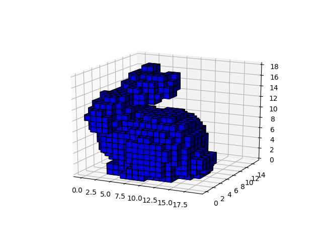

# STLSimple Voxelizer

Voxelizer for stl file.

## Related libraries
To install related libraries, please try following:
<pre>
pip install -r requirements.txt
</pre>

## Usage
Voxelize,
<pre>
python voxelize.py path_of_stlfile pitch process_num
</pre>

## Sample
I'll try voxelize file in ./sample.

<pre>
python voxelize.py ./assets/FLATFOOT_StanfordBunny_jmil_HIGH_RES_Smoothed.stl 5 4
</pre>

